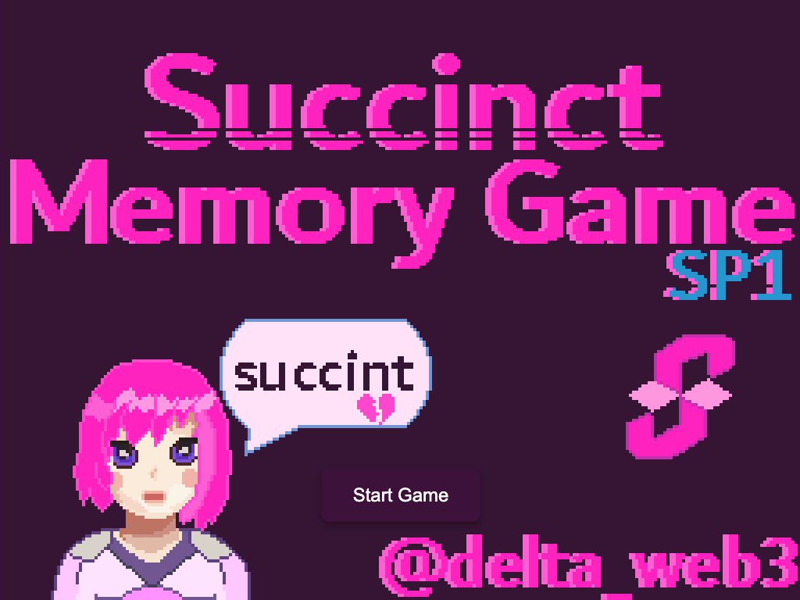
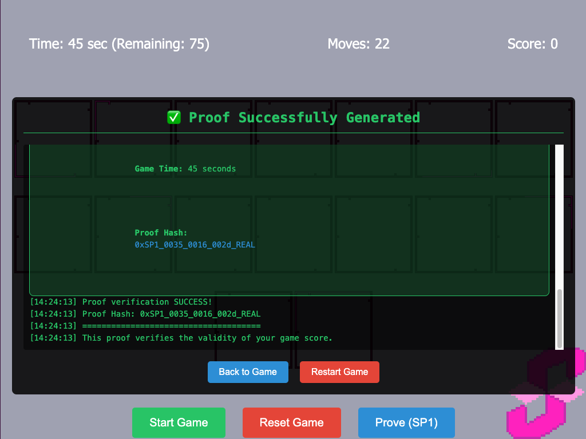

# SP1 Memory Game: Zero-Knowledge Proof Integration

A classic memory card matching game enhanced with SP1 zero-knowledge proof technology to cryptographically verify game scores. This game was developed for the Succinct RockStars Week #2 event. The game uses [SP1](https://github.com/succinctlabs/sp1) ZK technology.




## Features

- Custom scoring system: `Score = Remaining Time - Moves`
- Real SP1 ZK-STARK proofs to verify game scores
- Interactive memory card matching gameplay
- Full-stack integration (WebAssembly, Node.js, SP1)

## Technologies

- **Frontend**: HTML, CSS, JavaScript, Rust (compiled to WebAssembly)
- **Backend**: Node.js, Express.js
- **ZK System**: SP1 (Succinct's zkVM technology)
- **Languages**: Rust, JavaScript

## Deployed Version

This project is deployed on Vercel with simulation mode enabled. memory-game-sp1.vercel.app
- The deployed version uses simulation mode for proof generation
- To create real SP1 proofs, clone the repository and follow the installation instructions below

## Prerequisites

- Rust (with nightly toolchain)
- Node.js (v16+)
- SP1 tools (installed via `sp1up`)

## Installation

1. Clone the repository:
   ```bash
   git clone https://github.com/d3lta02/memory-game-sp1.git
   cd memory-game-sp1
   ```

2. Install SP1 tools (if not already installed):
    ```bash
    Copycurl -L https://sp1up.succinct.xyz | bash
    sp1up
    ```

3. Compile the WebAssembly module:
    ```bash
    wasm-pack build --target web
    ```

4. Install backend dependencies:
    ```bash
    cd backend
    npm install
    cd ..
    ```
**Running the Game**

1. Start the backend server:
    ```bash
    cd backend
    node server.js
    ```
2. In a separate terminal, start the frontend:
    ```bash
    # From the main directory
    npx serve
    # Or use Live Server in VS Code
    ```
Play the memory game, and after completion, click the "Prove(SP1)" button to generate a zero-knowledge proof of your score.

## Important Notes

SP1 Proof Generation: The backend server must be running to generate real SP1 proofs.
Simulation Mode: If the backend server is not running, the system will fall back to simulation mode.
Live Server Configuration: This repository includes VSCode Live Server settings to prevent page refreshes during proof generation. No additional configuration is required if you use VSCode's Live Server extension.


- **SP1 Proof Generation**: The backend server must be running to generate real SP1 proofs.
- **Simulation Mode**: If the backend server is not running, the system will fall back to simulation mode.

- Live Server Configuration: This repository includes VSCode Live Server settings to prevent page refreshes during proof generation. No additional configuration is required if you use VSCode's Live Server extension.

## Project Structure

memory-game-sp1/ - Main project directory
    src/ - Rust source code for the memory game
    pkg/ - Compiled WebAssembly files
    assets/ - Game assets (images, sounds)
    backend/ - Node.js backend for proof generation

    memory_proof/ - SP1 program and proof generation scripts
        program/ - RISC-V program for ZK proof
        script/ - Proof generation script

## How It Works

**Game Logic:** The memory card game is implemented in Rust and compiled to WebAssembly.
**Scoring System:** When a game completes, a score is calculated as Remaining Time - Moves.
**ZK Proof:** Clicking "Prove (SP1)" sends game data to the backend.

**Proof Generation:** The backend runs an SP1 program that:
    Verifies all 8 pairs were matched
    Checks the game was completed within the time limit
    Recalculates the score using the same formula
    Produces a ZK-STARK proof that these conditions were met
**Verification:** The proof is verified and the result is sent back to the frontend.

